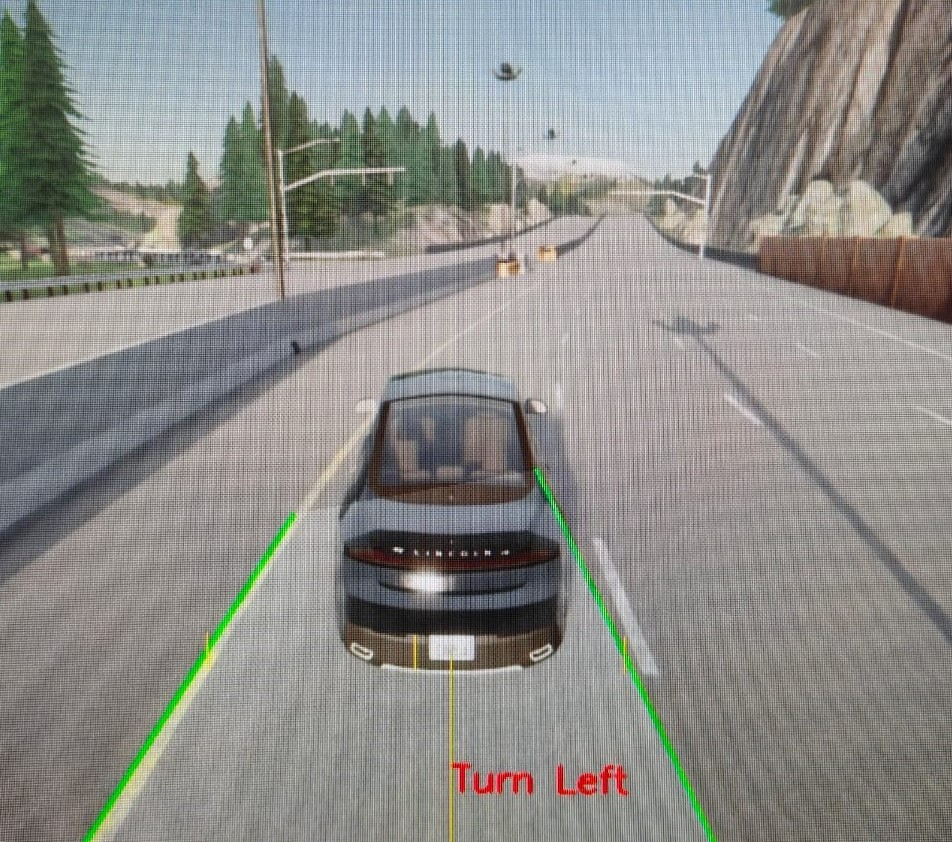

 # Autonomous Vehicle Lane Recognition using CARLA Simulator-
 
This study explores lane recognition in autonomous vehicle navigation using traditional computer vision techniques within the CARLA simulator. Our system leverages Gaussian blur, Canny edge detection, and the Hough transform to reliably detect and track lane markings across various driving scenarios.

**Methodology**

- Gaussian Blur: Initially applied to reduce noise in the images.
- Canny Edge Detection: Used to highlight the edges of the lanes.
- Hough Transform: Identifies and maps straight lines to corresponding lanes, adapting to different lighting and road conditions.

**Output**

# About Carla Simulator

**Carla** is an open-source simulator designed for autonomous driving research. It provides a flexible and realistic urban environment that can be used for developing, training, and testing autonomous driving systems.

## Key Features:
- **Realistic urban environment:** Carla provides dynamic urban settings with various elements such as pedestrians, vehicles, weather conditions, and more.
- **Extensive sensor suite:** Includes sensors like cameras, LIDAR, GPS, and radar, which are essential for building perception modules for autonomous vehicles.
- **Customizable scenarios:** Developers can create complex driving scenarios, including different weather conditions, lighting changes, and traffic configurations.
- **Flexible APIs:** Carla offers Python and C++ APIs that allow users to control vehicles, sensors, and the simulation environment.
- **Benchmarking and Validation:** Carla helps in testing and validating algorithms for autonomous navigation, including object detection, localization, planning, and control.

## Useful Links:
- Official website: [https://carla.org/](https://carla.org/)
- GitHub repository: [https://github.com/carla-simulator/carla](https://github.com/carla-simulator/carla)

